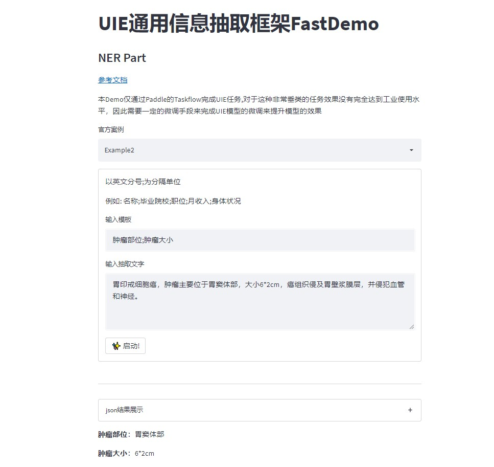

# 说明
借助Streamlit快速搭建可交互的基于UIE的信息抽取应用

目前仅展示了NER部分,待更新...

# 快速启动
1.clone本项目

2.请先根据requirements.txt安装对应依赖

3.激活对应环境，输入以下指定启动streamlit应用程序
```
streamlit run app.py
```

# 应用演示




# 感谢
- [百度飞浆PaddlePaddle](https://www.paddlepaddle.org.cn/)
- [Streamlit](https://streamlit.io/)
